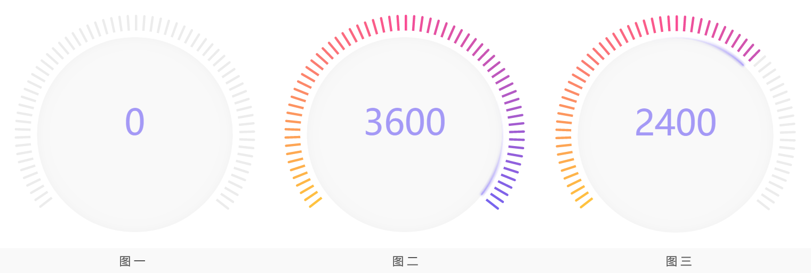

## 动一动，更健康
---

还记得去年这个时候，刚学习前端没多久，动画对我来说就是一片完全神秘的领地。clone下来create-react-app时，一个简单的`keyframes`动画都令我觉得神奇不已。回想今年的工作中，从一开始因为感兴趣而尝试在页面中加入简单的动画，到后来做出比较复杂的交互动画，我也在一步步猎奇的过程中对动画越来越有兴趣，可以在本来就紧张的开发周期中从容地去构思完成一个合理、流畅的动画。


### 一、神秘地初探——@keyframes
来到公司不久，接到了一个落地页面的任务，里边有一个引导下载的按钮，UI效果大概是这样：


看到效果图的时候，觉得箭头如果能流动起来，就可以更好地吸引用户注意而达到引导的效果。算是自己给自己派发的一个额外需求吧~

首先，我脑补了一下这个动画的效果：仿佛闪亮的箭头拖着箭羽一支支地从你窗前射过。描述好像有点尬==呃，那么关键就在于**周期性**和3个箭头**明暗度**的控制了。如果每个箭头在亮度 **高**、**中**、**低** 3档中间变化，那么实现箭射过效果最简单的方法，就是让高亮度依次出现在左、中、右3个箭头上；配合上中、低亮度的依次出现，整个箭头就有了从左至右“流动”起来的感觉。中间再加一点**间隔时间**的话，效果更好。以其中一个箭头关键帧的代码段为例：
``` css
@keyframes arrow-2 {
    0% { border-color: rgba(255, 255, 255, .5) }
    25% { border-color: rgba(255, 255, 255, .15) }
    75% { border-color: rgba(255, 255, 255, .15) }
    87.5% { border-color: rgba(255, 255, 255, .8) }
    100% { border-color: rgba(255, 255, 255, .5) }
}
```
可以看到低亮度`rgba(255, 255, 255, .15)`的帧数占比是最大的。设定一个动画周期内有8帧，这个时间间隔占到了3帧，其余帧数用于模拟箭的流动性。以 *3*，*2*，*1* 分别表示亮度的递减，`` `f_${i}` ``表示第i帧，下表展示了一个周期内三个箭头明暗度变化的情况：

|     | 箭头左 | 箭头中 | 箭头右 |
| --- | --- | --- | --- |
| f_1 | 1 | 2 | 3 |
| f_2 | 1 | 2 | 2 |
| f_3 | 1 | 1 | 2 |
| f_4 | 1 | 1 | 1 |
| f_5 | 1 | 1 | 1 |
| f_6 | 1 | 1 | 1 |
| f_7 | 3 | 1 | 1 |
| f_8 | 2 | 3 | 1 |

:disappointed_relieved: 好像还是比较难描述帧的设计呢。你可以想象把每一帧的动画依次画在一个本子的右下角，然后根据翻动本子所看到的样子去列表，再将每帧写进`@keyframes`，就ok了~需要注意的是`@keyframes`关键帧之间的变化是线性而非阶梯的，所以对于类似**箭头中**这样2->2->1->1->1->1->1->3的变化，你需要在第7帧也指定亮度为1，而不要偷懒直接写：
 ``` css
 @keyframes arrow-2 {
    0% { border-color: rgba(255, 255, 255, .5) }
    25% { border-color: rgba(255, 255, 255, .15) }  /* 第2帧，亮度1 */
    87.5% { border-color: rgba(255, 255, 255, .8) }  /* 第8帧，亮度3 */
    100% { border-color: rgba(255, 255, 255, .5) }
}
 ```
这样会直接从第2帧的低亮度渐变到第8帧的高亮度，从而破坏了我们设计的第4—6帧的时间间隔，也没有了流动的感觉。这也是整个动画的关键所在。你可以试着注释掉我下面给出地址的源码中3个箭头对应的这一关键帧定义，所得到的动画效果是非常差强人意的。

最终效果我觉得还挺棒的，UI小姐姐对还原度的时候她惊讶的说，哇原来你们也能做这个，我都没有要求这里。。吼吼，源码在这里，感兴趣的读者可以戳去codepen看看效果——[Flowing Arrow](https://codepen.io/xiaodudu/pen/GyNKKL?editors=0100)


### 二、让选择题做起来更优雅一些
年中公司前端技术栈进行升级后，相应的重构任务有不少表单页面，其中就包含一个比较典型的组件——上方展示所选项，配合下面可以展开/闭合的选项组。


当时重构页面没有动画，选项组就是在点击展开按钮后“出现”和“消失”而已。而自己对动画正是一腔热情的时候，所以又自己给自己脑补了加上动画的任务。。我想像着选项组优雅地展开、闭合的情形，简直不能自已！

由于这是一个交互类型的动画，展开、闭合两部分过程又大体对称，所以利用js控制触发，具体动画的实现交由css完成即可。比如在css中对某个元素应用`transition: all 1s linear`，在js中将该元素某支持动画的属性由初始的p0状态赋值为p1状态，则此属性对应状态将在1s内线性完成转换。下面的动画设计遵循的也都是这一原理。

#### 1. 展开按钮的动画设计

展开按钮通过指向的不同指示了选项组展开/闭合的状态，其由某一指向旋转至另一指向也是整体动画中不可缺少的一部分。如果你和我一样想只应用`tranform`中的`rotate`操作完成这一动画，那么就需要注意切图或者`tranform-origin`属性的设置；由于我是利用`border-top`和`border-right`模拟箭头，那么在我的动画中需要处理的就是后者了。

`transform-origin: (x0, y0, z0)`，顾名思义就是进行`tranform`变换时的原点，3个参数分别代表距离元素左边界、上边界，z=0平面的距离，默认值是50%, 50%, 0。我们需要计算设置的就是用`border`属性模拟出的箭头的变换原点，如下图所示


这是至关重要的一点，因为需要对模拟箭头进行`rotate`操作来绘制出展开按钮向上/向下的指向及动画中间过程，比如图中，从p0位置逆时针旋转β度到p1位置，`transform-origin`正是旋转参考点，设置不同的参考点最终旋转出的效果也不同：


而我们需要做的，如图所示，就是通过几何关系算出一个`transform-origin`，使展开按钮展开/闭合的位置恰好符合UI设计。


算出`transform-origin`后，我们只需要进行`rotate`操作，并配合合适的时长和变化函数，就能够实现展开按钮的动画了。


#### 2. 选项组的动画设计

选项组的展开/闭合直接对应着高度的变化，变化的方式我想到了两种思路：
* 改变包含选项组的父级元素的`height`属性
* 对包含选项组的父级元素应用`tranform`的`scaleY`操作

前一种方法简单快捷，但需要重新计算页面的layout，在大型页面中可能渲染很慢，导致动画不够流畅；后一种方法渲染代价低，但需要注意`scale`操作会同时改变子元素尺寸的问题，并且初始高度不能为0，这就需要我们在闭合状态时想办法把它“藏”起来。由于当时的页面比较简单，我选择了第一种brutal的做法，先做一次尝试。

我的具体做法是将选项组放进一个container中，对其应用`overflow: hidden`，通过改变container的`height`属性值大小决定选项组露出的高度，并配合选项组`translateY`属性的变化，制造出选项组下降/上升的效果，如图所示：


此动画的最终效果参见[Gently Expand/Collapse Animation](https://codepen.io/xiaodudu/pen/BJQyNP?editors=0010)。通过上面两点的设计，可以做出一个基本达标的动画——有明确的交互意义，一定程度上提升了用户体验；但是如果要追求更优雅的体验，需要更加仔细的观察，去发现什么变化在呈现给用户的时候是突兀的，什么变化的反馈不易被察觉，从而削弱了交互上的感受？我在调试的时候就发现有些关键细节虽然微小，但是一旦发现了它哪怕一点点不妥的地方并进行相应的改善，就能给整体带来跟之前完全不同的感觉。比如，选项组中选项的文字，是直接自其container的上边框下落出现/上升消失的，这种从边缘就能体察到的变化就给人比较突兀的感觉。如果对这些文字的opacity属性应用变化，让选项组下落的同时渐现，container的上边框就不会被衬托得很硬朗，整体给人的感觉也就柔和许多。再比如，显示当前所选项的文字会在用户作出新的选择后相应改变，如果中间没有过渡，那么对于文字相差较大的前后两次选项，会带给人突兀的感觉，而对于文字相差较小的选项给用户的反馈则不明显，容易使用户困惑。而我们只需要在新选择发生时，让前一选项渐隐，后一选项渐现，就能给予用户足够的反馈和提示：嗯，我们知道你做出了新的选择，并记录了下来，请你放心 :)


### 三、这次没css什么事~
下面这个例子既包含向用户展现的单方面动画，也包含与用户操作交互的动态效果，全部由js完成。页面包含类似下面图一的一个圆盘组件，页面加载后圆盘周围的条状物顺时针逐渐点亮，至图二状态，再反向熄灭至图一状态；此后用户可以通过手指滑动使条状物点亮至对应位置，圆盘中间的数字也根据点亮的比例相应增大或减小，效果如图三。



由于条状物顺时针方向颜色的渐变和大于180度的占位，不好通过切图和旋转完成滑动点亮的效果，所以我的想法是通过js循环输出一组`div`模拟之，能够既简单、又可控地渲染出其渐变的颜色和整体对称的位置。将这些`div`从顺时针编号，那么对于动画及后续操作交互的渲染输出部分，关键就在于明确当前应点亮至第几个`div`——我们将其记为`glowingCnt`。所以仅需记录这一个变量，就能根据它确定出每一个`div`是点亮(呈现渐变颜色)还是置灰状态。

我采用了`window.requestAnimationFrame(callback)`方法来控制`glowingCnt`的递增/递减，从而渲染出条状物顺时针点亮/逆时针熄灭的效果。此方法执行原理是在**浏览器下次重绘页面前**执行传入的`callback`函数，故在动画结束前需要不断地被调用。一般浏览器的重绘频率是60帧左右，所以如果动画的成本不高，基本可以借助此方法完成一个流畅的动画。

后续用户进行滑动时，通过监听`touch`相关的几个事件，改变`glowingCnt`的值，就能够达到滑动点亮的效果。

这个例子的效果可见[Glowing Sticks](https://codepen.io/xiaodudu/pen/jYwKog?editors=0010)。开始觉得这个动画是有些复杂的，不过由于几何和操作上都基本对称，一旦找到规律就会很好处理了。在接到动画需求时，我们通常得到的是一段过程的描述，具体一点的比如“这个要滚动展示”，“这个需要在几秒以后渐隐”，不那么具体的会说“这个要有漂浮的感觉”等等。以我浅薄的经验认为，做动画最重要的就是如何抽象这个过程，然后通过具体的元素展现出来。有时这种抽象显而易见，但具体的实现效果需要更长的时间去尝试；有时这种抽象就不那么明显，十个人可能就有好几种不同的想法。这种情况我一般会花较多时间去发散思维，一旦摸索出一种比较合适的抽象方法，后面写代码就会很流畅。


